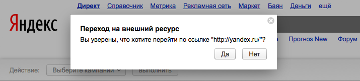
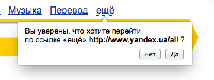

DOM homework
======

Попап
------------

Есть ссылка с классом `popup-link`, у нее есть два атрибута: `data-title` и `data-message`.

По клику на неё, не должно быть перехода по URL, а должен открываться попап (создаваться и добавляться в DOM) с заголовком и сообщением из data-атрибутов. Он должен центрироваться относительно окна браузера.

Причем в атрибуте `data-message` могут присутствовать специальные символы `%s`, которые должны быть заменены на URL ссылки.

У попапа должны быть две кнопки "Да" и "Нет". Первая осуществляет переход по URL ссылки, вторая закрывает попап (и удаляет его из DOM).

На старые браузеры и IE ориентироваться не стоит.

Функциональные и логические улучшения приветствуются!

Как может выглядеть попап
------------------------

